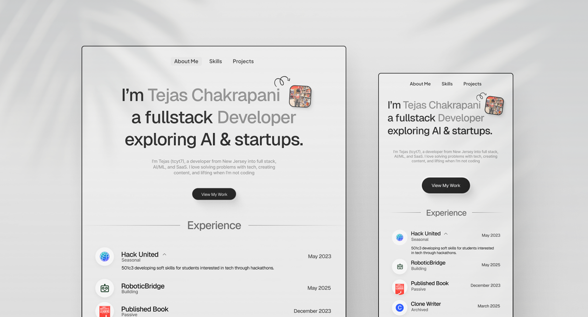

# Portfolio Website – [Tejas Chakrapani]

A modern, fully responsive portfolio website built for a US-based client to showcase their work, achievements, and services with an elegant design and smooth user experience.

## Tech Stack

- React.js (Frontend Framework)
- Tailwind CSS (Styling)
- GSAP (Animations)
- Figma (UI/UX Design)
- Vite (Build Tool)

## About the Project

The client wanted a clean and minimal portfolio that reflects professionalism and creativity.  
I designed and developed a fully responsive website using modern frontend technologies with optimized performance and smooth animations.

## 🚀 Live Demo

🔗 [Visit Live Site](https://tejasc.xyz)

## 🎯 Features

- Fully responsive on all devices
- Smooth GSAP animations
- Modern and minimal UI
- Built with reusable components

## Contact

If you’d like to connect or discuss a project, reach me here:

- **Twitter:** [@yourhandle](https://x.com/prashant_kvian)
- **Email:** prashant1warghude@gmail.com
